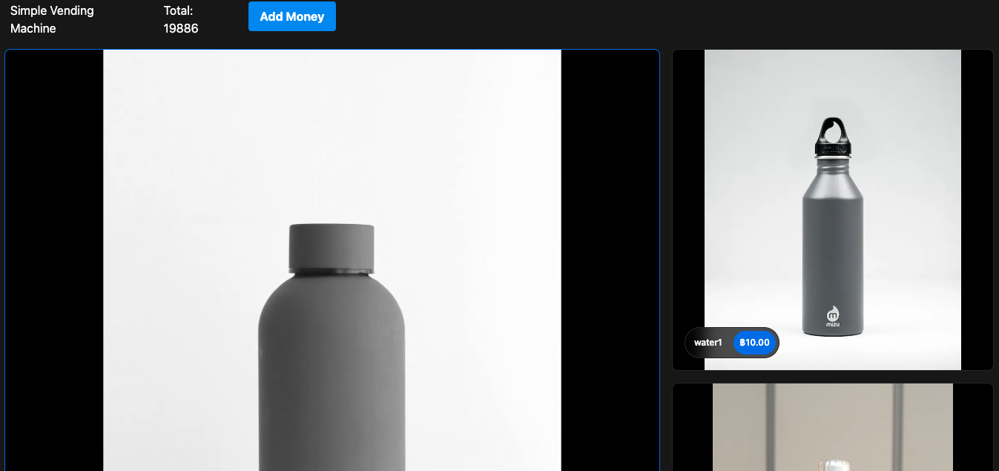

This is a [Next.js](https://nextjs.org/)

## Require System

```bash
Docker
```

## Getting Started

First, run the development server:

```bash
 docker-compose up -d
```

Open [http://localhost:3000](http://localhost:3000) with your browser to see the result.

When your runing backend completely. It sholud look like this


